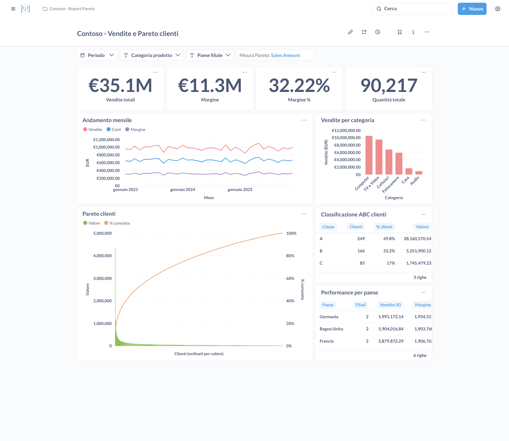

# Report Contoso su Metabase OSS (report as code)

Porting del report Power BI "Vendite e Pareto clienti" su **Metabase Open Source**, gestito interamente da file versionati in Git.



*Screenshot generato con i dati di esempio sintetici di `warehouse/02_seed.sql`.*

📗 **[Guida all'uso di Metabase in locale con SQL Server](docs/GUIDA_USO_METABASE.md)**: installazione su Windows, collegamento dei dati, esercitazioni passo-passo, backup, risoluzione dei problemi.

📘 **[Guida e confronto con Power BI](docs/GUIDA_PowerBI_vs_Metabase.md)**: mappa dei concetti, equivalenza delle misure DAX, ciclo di vita, quando scegliere cosa, rischi.

## Perché "manutenibile"

Metabase OSS salva domande e dashboard nel proprio database applicativo; la serializzazione in YAML è una funzione delle edizioni a pagamento. Qui la fonte di verità è il repository:

| Livello | File | Cosa contiene |
|---|---|---|
| Infrastruttura | `docker-compose.sqlserver.yml`, `.env.sqlserver.example` | Metabase + database interno, collegati al SQL Server installato su Windows |
| | `docker-compose.yml`, `.env.example` | Alternativa tutta in Docker: Metabase + warehouse PostgreSQL |
| Dati SQL Server | `sqlserver/01…04_*.sql` | Database `ContosoLab`, dati di esempio, vista misure, utente in sola lettura (da eseguire in SSMS) |
| Dati PostgreSQL | `warehouse/*.sql` | Lo stesso star schema per PostgreSQL |
| Livello semantico | vista `contoso.v_sales_line` | Misure DAX tradotte in SQL, definite una sola volta |
| Query | `report/sql/sqlserver/`, `report/sql/postgres/` | Una domanda Metabase per file, nel dialetto di ciascun database |
| Report | `report/report.yml` | Filtri, card, formattazione e layout del dashboard |
| Deploy | `scripts/deploy.py` | Applica `report.yml` a Metabase tramite REST API, in modo idempotente |
| Controllo | `.github/workflows/report.yml` | A ogni modifica valida la definizione ed esegue tutte le query, su PostgreSQL e su SQL Server 2022 |

Le modifiche fatte a mano nell'interfaccia di Metabase vengono sovrascritte al deploy successivo. Per l'esplorazione libera conviene usare una collection diversa da quella gestita.

## Avvio in locale

### Opzione 1 — Windows con SQL Server installato (consigliata)

Tutti i passaggi, spiegati per chi parte da zero, sono nella **[guida all'uso](docs/GUIDA_USO_METABASE.md)**. In sintesi:

1. In SSMS eseguite in ordine `sqlserver/01_database_e_tabelle.sql`, `02_dati_esempio.sql`, `03_vista_misure.sql` e `04_utente_metabase.sql` (dopo aver cambiato la password).
2. In PowerShell:

   ```powershell
   Copy-Item .env.sqlserver.example .env      # poi cambiare le password
   docker compose -f docker-compose.sqlserver.yml --env-file .env up -d
   py -m pip install -r scripts\requirements.txt
   py scripts\deploy.py apply
   ```

### Opzione 2 — Tutto in Docker con PostgreSQL

```bash
cp .env.example .env              # poi cambiare le password
docker compose --env-file .env up -d
pip install -r scripts/requirements.txt
python scripts/deploy.py apply --target postgres
```

In entrambi i casi, al primo avvio lo script crea l'utente amministratore (`MB_ADMIN_EMAIL` / `MB_ADMIN_PASSWORD`), collega il database con l'utente in sola lettura `metabase_ro` e pubblica il dashboard. L'indirizzo viene stampato alla fine (di norma http://localhost:3000/dashboard/2). Il database di destinazione si sceglie con `MB_TARGET` nel `.env`, oppure con `--target`.

## Contenuto del dashboard

| Card | Misura DAX di origine |
|---|---|
| Vendite totali, Margine, Margine %, Quantità totale | `Sales Amount`, `Margin`, `Margin %`, `Total Quantity` |
| Andamento mensile | Vendite, costi e margine per mese |
| Vendite per categoria | `Sales Amount` per `Product[Category]` |
| Performance per paese | KPI per paese della filiale |
| Pareto clienti | `Pareto Amount` + `Pareto %` (barre + linea cumulata) |
| Classificazione ABC clienti | A fino all'80% del valore cumulato, B fino al 95%, C il resto |

Filtri: **Periodo**, **Categoria prodotto**, **Paese filiale** (applicati a tutte le card) e **Misura Pareto** (Sales Amount, Margin, Total Cost, Total Quantity), che sostituisce la tabella disconnessa `Metric[Measure]` del modello Power BI.

## Modificare il report

1. **Cambiare una query**: modificare il file in `report/sql/<target>/` (in entrambi i dialetti, se usate entrambi i database) ed eseguire `python scripts/deploy.py apply`.
2. **Aggiungere una card**: creare il file SQL in ogni cartella `report/sql/<target>/`, aggiungere la voce in `cards:` e la posizione in `dashboard.layout` (griglia di 24 colonne). I filtri si inseriscono nella query come `{{nome_filtro}}` e vanno elencati in `filters:` della card.
3. **Aggiungere un filtro**: definirlo in `filters:` (con `field: [tabella, colonna]` per collegarlo a una colonna, oppure con `values:` per un elenco fisso) e aggiungerlo a `dashboard.filters`.
4. **Rimuovere una card**: toglierla da `report.yml` ed eseguire `python scripts/deploy.py apply --prune`, che la archivia.
5. **Aggiornare Metabase**: cambiare `METABASE_VERSION` in `.env`, riavviare e rieseguire il deploy.

`python scripts/deploy.py validate` controlla la definizione senza bisogno di Metabase: tag delle query coerenti con i filtri dichiarati, card esistenti, layout senza sovrapposizioni.

Le card sono riconosciute **per nome** all'interno della collection gestita: rinominare una card equivale a crearne una nuova (la vecchia si archivia con `--prune`).

## Regole per le query

- I field filter di Metabase generano riferimenti del tipo `"contoso"."v_sales_line"."order_date"`: per questo le tabelle nelle query **non usano alias**.
- Un field filter senza valore diventa `1 = 1`, quindi `WHERE {{order_date}} AND {{category}} AND {{country}}` funziona anche senza filtri attivi.
- Le misure base vanno lette da `contoso.v_sales_line`, non ricalcolate nelle singole query.

## Passaggio ai dati reali

Gli script `02_dati_esempio.sql` (SQL Server) e `warehouse/02_seed.sql` (PostgreSQL) generano dati **sintetici** solo per imparare e fare prove. Per usare il database Contoso reale su SQL Server:

1. creare sul database reale lo schema `contoso` e una vista come `sqlserver/03_vista_misure.sql`, adattata ai nomi reali delle colonne;
2. creare un utente in sola lettura, come in `sqlserver/04_utente_metabase.sql`;
3. in `report/report.yml`, nel target `sqlserver`, aggiornare `dbname` (ed eventualmente `user`); nel `.env` aggiornare `MB_WAREHOUSE_HOST`, `MB_WAREHOUSE_PORT` e `WAREHOUSE_RO_PASSWORD`;
4. eseguire `py scripts\deploy.py apply` e riconciliare i KPI con il report Power BI.
