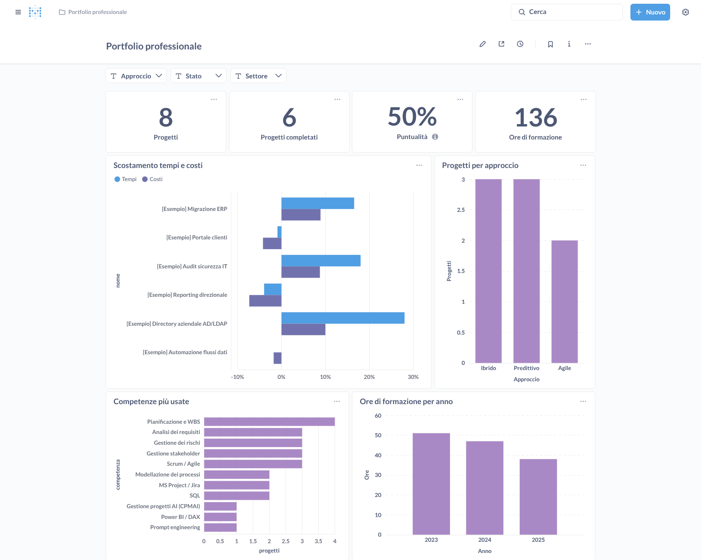
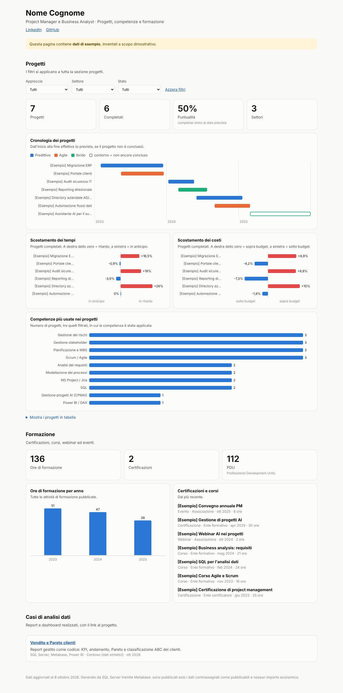

# Guida: il portfolio professionale, da SQL Server a LinkedIn

Questa guida aggiunge al vostro ambiente locale un **secondo report**, dedicato al vostro profilo professionale (progetti, competenze, formazione, casi di analisi). Lo stesso report diventa una **pagina web pubblica** da collegare a LinkedIn.

Prerequisito: avete completato la [guida all'uso di Metabase](GUIDA_USO_METABASE.md). SQL Server, Metabase in Docker e lo script `deploy.py` funzionano già.

> **Legenda:** ✅ provato in ambiente di test (SQL Server 2022, Metabase v0.56.6) · **[Non verificato]** da controllare · **[Inferenza]** consiglio ragionato.

---

## 0. Il percorso in sintesi

```
 SQL Server (PortfolioLab)  ──►  Metabase (localhost)  ──►  data.json  ──►  GitHub Pages  ──►  link su LinkedIn
   voi inserite i dati          report privato, completo    solo dati         pagina pubblica     "In primo piano"
   con SSMS                     con tutti i dettagli        pubblicabili      interattiva         o in un post
```

| ✔ | Passo | Controllo | Sezione |
|---|---|---|---|
| ☐ | Database PortfolioLab creato | In SSMS compare **PortfolioLab** con 5 tabelle | 2 |
| ☐ | Report Metabase pubblicato | Lo script stampa **Dashboard pronto** | 3 |
| ☐ | Vostri dati inseriti | Il report mostra i vostri progetti | 4 |
| ☐ | Pagina web attivata | `https://franklucs84.github.io/reporting-metabase/` si apre | 6 |
| ☐ | Link su LinkedIn | Il riquadro con anteprima compare nel profilo | 7 |

> **LinkedIn non permette di incorporare una dashboard interattiva** dentro il profilo o un post: non accetta codice di altri siti. La soluzione usata qui è la pratica standard: una **pagina web pubblica** con la dashboard e, su LinkedIn, un **link con immagine di anteprima** [Non verificato: le funzioni di LinkedIn cambiano nel tempo].

---

## 1. Cosa contiene il portfolio

### 1.1 Le tabelle (schema `portfolio` nel database `PortfolioLab`)

| Tabella | Cosa ci mettete | Campi principali |
|---|---|---|
| `progetto` | I progetti seguiti come PM / BA | codice, nome, settore, **approccio** (Predittivo / Agile / Ibrido), ruolo, **stato** (Pianificato / In corso / Completato / Sospeso), date di inizio e fine (prevista ed effettiva), budget e costo (facoltativi), soddisfazione cliente 1–5, descrizione, **pubblicabile** |
| `competenza` | Le vostre competenze | nome, area (Project Management, Business Analysis, Dati e Reporting, Intelligenza Artificiale, Strumenti), livello 1–5 |
| `progetto_competenza` | Quali competenze avete usato in quali progetti | collegamento progetto ↔ competenza |
| `formazione` | Certificazioni, corsi, webinar, eventi | titolo, ente, tipo, area, data, ore, PDU, link alla credenziale, **pubblicabile** |
| `caso_analisi` | Report e dashboard realizzati | titolo, dataset, strumenti, data, link, descrizione, **pubblicabile** |

### 1.2 I KPI calcolati (vista `portfolio.v_progetto_kpi`)

| KPI | Formula | Note |
|---|---|---|
| Scostamento tempi | (durata effettiva − durata prevista) / durata prevista | > 0 = ritardo. Solo progetti con data di fine effettiva |
| Scostamento costi | (costo effettivo − budget) / budget | > 0 = sopra budget. **Solo progetti Completati**: a progetto in corso il costo sostenuto finora non è confrontabile con il budget totale |
| Puntualità | completati entro la fine prevista / completati | Calcolata nel report |

[Inferenza] Sono indicatori semplici di Schedule e Cost Management (PMBOK). Non sostituiscono SPI e CPI dell'Earned Value, che richiederebbero il valore pianificato e il valore guadagnato nel tempo.

### 1.3 Riservatezza: cosa diventa pubblico

| Dato | Report Metabase (solo sul vostro PC) | Pagina web pubblica |
|---|---|---|
| Righe con `pubblicabile = 0` | ✅ visibili | ❌ **mai** esportate |
| Budget e costo in euro | ✅ visibili | ❌ **mai** esportati: solo lo scostamento in % |
| Nomi, descrizioni, date | ✅ | ✅, solo per le righe pubblicabili |
| Competenze | ✅ | ✅ tutte, con il conteggio sui soli progetti pubblicabili |

✅ Provato: l'export contiene 7 progetti su 8 (quello con `pubblicabile = 0` è escluso) e nessun campo `budget_previsto` o `costo_effettivo`. Il workflow di pubblicazione blocca la pagina se trova importi economici nel file.

> ⚠️ **Prima di segnare un progetto come pubblicabile**, verificate di poterlo citare: nomi dei clienti, importi e informazioni interne possono essere coperti da accordi di riservatezza. Nel dubbio, usate descrizioni generiche (per esempio "Migrazione ERP – settore manifatturiero") [Inferenza].

---

## 2. Creare il database PortfolioLab (SSMS, 5 minuti)

Nella cartella `sqlserver/portfolio/` della repository. Eseguite i file **in ordine** con SSMS (**File → Apri → File…**, poi **F5**), come per Contoso:

| Script | Cosa fa | Quando |
|---|---|---|
| `01_database_e_tabelle.sql` | Crea `PortfolioLab`, lo schema `portfolio` e le 5 tabelle | Una volta. ⚠️ Rieseguirlo **cancella tutti i dati** |
| `02_vista_kpi.sql` | Crea la vista dei KPI | Una volta (si può rieseguire senza perdere dati) |
| `03_dati_esempio.sql` | Inserisce dati **inventati** (codici `ESEMPIO-…`) per vedere subito il report | Facoltativo |
| `04_utente_metabase.sql` | Dà a `metabase_ro` la **sola lettura** sullo schema `portfolio` | Una volta |
| `05_cancella_esempi.sql` | Cancella **solo** i dati di esempio | Quando inserite i vostri dati |
| `06_modello_inserimento.sql` | **Modello** da copiare per inserire i vostri dati | Ogni volta che aggiungete qualcosa |

✅ Provato: dopo lo script 03 compaiono 8 progetti, 12 competenze, 25 collegamenti, 7 attività di formazione e 1 caso di analisi.

---

## 3. Pubblicare il report in Metabase (2 minuti)

Con Metabase acceso, nella cartella del progetto in PowerShell:

```powershell
python scripts\deploy.py apply --report report\portfolio\portfolio.yml
```

Lo script collega il database **Portfolio (SQL Server)**, crea la collezione **Portfolio professionale** e il dashboard. ✅ Provato: tutte le 9 schede restituiscono dati, anche con i filtri attivi.



| Scheda | Cosa mostra |
|---|---|
| Progetti · Completati · Puntualità · Ore di formazione | I numeri chiave |
| Scostamento tempi e costi | Per ogni progetto completato: ritardo/anticipo e costo sopra/sotto budget |
| Progetti per approccio | Predittivo, Agile, Ibrido |
| Competenze più usate | In quanti progetti avete applicato ogni competenza |
| Ore di formazione per anno | Andamento della formazione |
| Elenco progetti | Tabella completa, compresa la colonna **Pubblicabile** |

Filtri: **Approccio**, **Stato**, **Settore** (agiscono sulle schede dei progetti).

---

## 4. Inserire i vostri dati

1. **Togliete gli esempi** (se li avevate caricati): eseguite `05_cancella_esempi.sql`.
2. Aprite `06_modello_inserimento.sql`: contiene un blocco pronto per ogni tabella, con le regole scritte in cima.
3. Copiate un blocco in una **Nuova query**, sostituite i valori ed eseguite con **F5**.
4. In Metabase ricaricate il dashboard: i dati compaiono subito, perché Metabase legge dal database in diretta.

**Regole che evitano gli errori più comuni:**

| Regola | Esempio |
|---|---|
| Date nel formato `'AAAA-MM-GG'` | `'2025-03-31'` |
| Testi tra `N'...'` | `N'Migrazione ERP'` |
| Apostrofo nel testo = due apostrofi | `N'Analisi dell''impatto'` |
| Dato mancante = `NULL` senza apici | `data_fine_effettiva = NULL` |
| Approccio, stato, tipo e area solo tra i valori ammessi | `N'Ibrido'`, `N'Completato'` (il database rifiuta gli altri) |
| `pubblicabile`: 1 = sulla pagina pubblica, 0 = privato | iniziate con 0, poi decidete |

**Correggere o rendere pubblico un progetto:**

```sql
UPDATE portfolio.progetto SET stato = N'Completato', data_fine_effettiva = '2025-07-10'
WHERE codice = N'PRJ-2025-01';

UPDATE portfolio.progetto SET pubblicabile = 1 WHERE codice = N'PRJ-2025-01';
```

---

## 5. Preparare la pagina pubblica

### 5.1 Il vostro profilo (una volta)

Aprite `portfolio-site\profilo.json` con Blocco note e compilate:

```json
{
  "nome": "Il vostro nome e cognome",
  "titolo": "Project Manager e Business Analyst · Progetti, competenze e formazione",
  "link": [
    { "testo": "LinkedIn", "url": "https://www.linkedin.com/in/il-vostro-profilo/" },
    { "testo": "GitHub", "url": "https://github.com/FrankLucs84" }
  ]
}
```

I link devono iniziare con `https://`; gli altri vengono ignorati per sicurezza.

### 5.2 Esportare i dati (ogni volta che li aggiornate)

Con Metabase acceso:

```powershell
python scripts\export_portfolio.py
```

Lo script scrive `portfolio-site\data.json` con **solo** i dati pubblicabili. ✅ Provato.

Se compare *"ATTENZIONE: l'export contiene ancora dati di esempio"*, la pagina mostrerà un avviso giallo "dati di esempio": eseguite `05_cancella_esempi.sql` e ripetete l'export.

### 5.3 Vedere la pagina sul vostro PC prima di pubblicarla

```powershell
cd portfolio-site
python -m http.server 8000
```

Aprite **http://localhost:8000** nel browser. Per chiudere: **Ctrl + C** in PowerShell, poi `cd ..`.



La pagina è interattiva:
- filtri per approccio, settore e stato;
- cronologia dei progetti;
- scostamenti di tempi e costi;
- competenze, formazione e casi di analisi;
- tooltip al passaggio del mouse (e con il tasto Tab);
- vista tabellare;
- tema chiaro e scuro automatico;
- impaginazione adatta al telefono.

✅ Provato in chiaro, scuro e a 390 px di larghezza, senza scorrimento orizzontale.

---

## 6. Pubblicare su GitHub Pages (gratis)

### 6.1 Attivare Pages (una volta sola)

1. Su GitHub aprite la repository **reporting-metabase** → **Settings** → **Pages**.
2. Alla voce **Source** scegliete **GitHub Actions**.

[Non verificato: posizione esatta del menu nell'interfaccia di GitHub.] La repository è **pubblica**, requisito per usare Pages gratis con un account personale [Non verificato: condizioni del piano GitHub].

### 6.2 Caricare i file aggiornati

Ogni volta che cambiate `data.json` o `profilo.json`, il caricamento su GitHub avvia la pubblicazione automatica.

**Senza Git (dal sito):**
1. Su GitHub aprite la cartella **portfolio-site**.
2. **Add file → Upload files** e trascinate `data.json` (e `profilo.json`, se modificato).
3. In fondo scrivete una descrizione (es. "Aggiorno i dati del portfolio") e cliccate **Commit changes**.

**Con Git:**
```powershell
git add portfolio-site/data.json portfolio-site/profilo.json
git commit -m "Aggiorno i dati del portfolio"
git push
```

### 6.3 Controllare la pubblicazione

- Su GitHub, scheda **Actions** → workflow **Pubblica portfolio**: deve diventare verde (1–3 minuti).
- Il workflow controlla che `data.json` non contenga importi, **genera da solo l'immagine di anteprima** per LinkedIn (`anteprima.png`, 1200×627) e pubblica la pagina.
- Indirizzo della pagina: **https://franklucs84.github.io/reporting-metabase/** [Inferenza: è l'indirizzo standard di GitHub Pages per questa repository].

> 🧯 **Se il workflow fallisce al passo "deploy-pages"**: Pages non è ancora attivato con **Source: GitHub Actions** (6.1). Attivatelo, poi in **Actions → Pubblica portfolio → Run workflow** rilanciatelo.

---

## 7. Mostrarlo su LinkedIn

### 7.1 Nella sezione "In primo piano" del profilo (consigliato)

1. Dal vostro profilo: **Aggiungi sezione del profilo → Consigliato → Aggiungi elementi in primo piano → Aggiungi un link** [Non verificato: i nomi dei menu di LinkedIn cambiano spesso].
2. Incollate `https://franklucs84.github.io/reporting-metabase/`.
3. LinkedIn legge titolo, descrizione e **immagine di anteprima** dalla pagina. Potete modificare titolo e descrizione, per esempio:
   - **Titolo:** *Portfolio professionale – dashboard interattiva*
   - **Descrizione:** *Progetti, competenze e formazione da un database SQL Server, pubblicati con Metabase e GitHub Pages.*

### 7.2 In un post

Esempio di testo da adattare:

> Ho costruito una dashboard interattiva del mio percorso professionale: progetti per approccio (predittivo, agile, ibrido), scostamenti di tempi e costi, competenze applicate e formazione.
> Stack: SQL Server come database, Metabase per il reporting, GitHub Pages per la pubblicazione, tutto gestito come codice.
> 👉 [link alla pagina]
> #ProjectManagement #BusinessAnalysis #DataVisualization #SQL

[Inferenza] Un breve video o una GIF di pochi secondi, in cui usate i filtri, attira più attenzione di un link da solo. Lo potete registrare con lo **Strumento di cattura** di Windows.

> 🧯 **L'anteprima su LinkedIn è vecchia o assente:** LinkedIn conserva in memoria le anteprime. Usate il **Post Inspector** di LinkedIn (cercate "LinkedIn Post Inspector") e inserite l'indirizzo della pagina per aggiornarla [Non verificato: disponibilità dello strumento].

---

## 8. Ciclo di aggiornamento (5 minuti, quando volete)

```
SSMS: inserite o aggiornate i dati  →  Metabase: controllate il report (privato)
   →  python scripts\export_portfolio.py  →  caricate data.json su GitHub  →  la pagina si aggiorna da sola
```

---

## 9. Rischi e controlli

| ID | Rischio | Mitigazione | Stato |
|---|---|---|---|
| P1 | Pubblicare dati riservati di clienti o del datore di lavoro | Campo `pubblicabile` (predefinito 0); nessun importo esportato; verifica degli accordi di riservatezza | Mitigato per costruzione; la verifica contrattuale è a carico vostro |
| P2 | Dimenticare dati di esempio sulla pagina pubblica | Avviso dello script di export e banner giallo sulla pagina | ✅ Provato |
| P3 | Anteprima LinkedIn non aggiornata | Generata a ogni pubblicazione; Post Inspector | [Non verificato] su LinkedIn |
| P4 | Indicatori interpretati come EVM | Formule dichiarate in 1.2 e sulla pagina | Documentato |
| P5 | Pagina non raggiungibile se Pages non è attivato | Passo 6.1; il workflow fallisce in modo visibile | Documentato |

## 10. Domande aperte

1. Quali progetti reali potete citare pubblicamente, e con quale livello di dettaglio?
2. Volete mostrare anche le certificazioni con il link alla credenziale verificabile (per esempio Credly)?
3. Preferite la pagina in italiano, in inglese o in entrambe le lingue?
