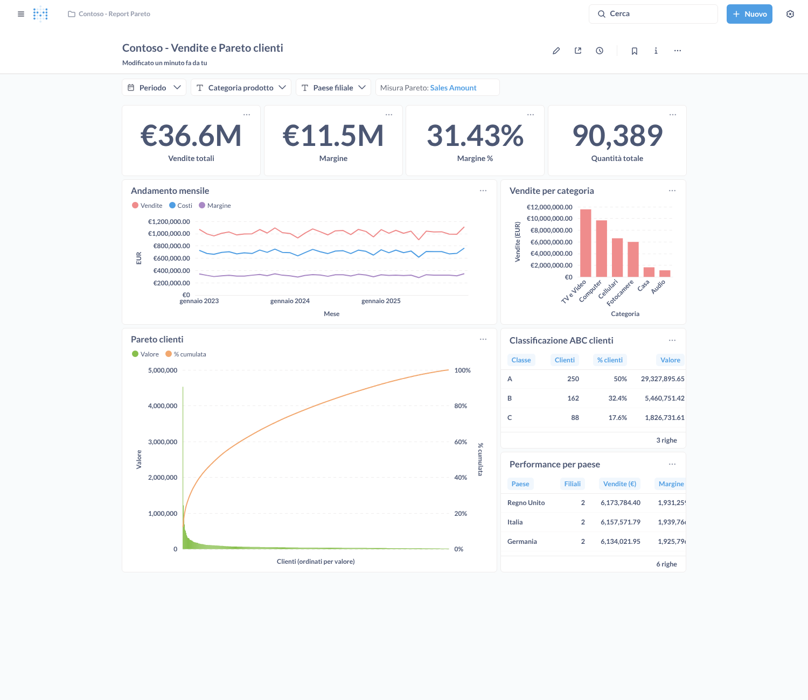
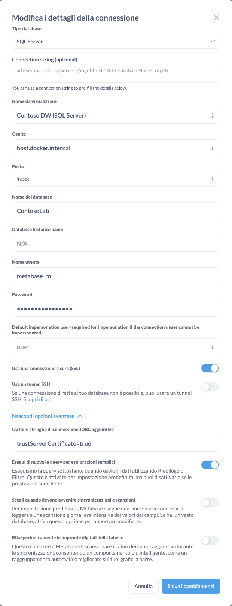
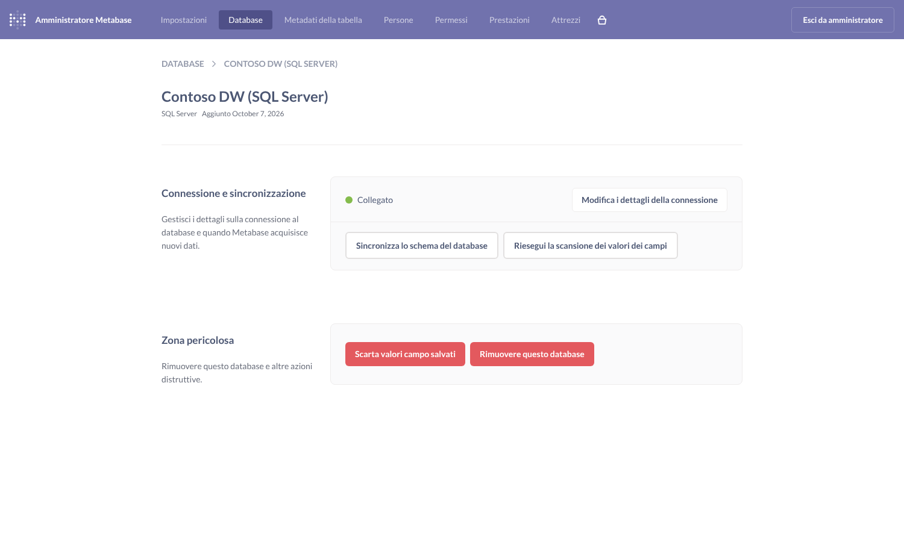
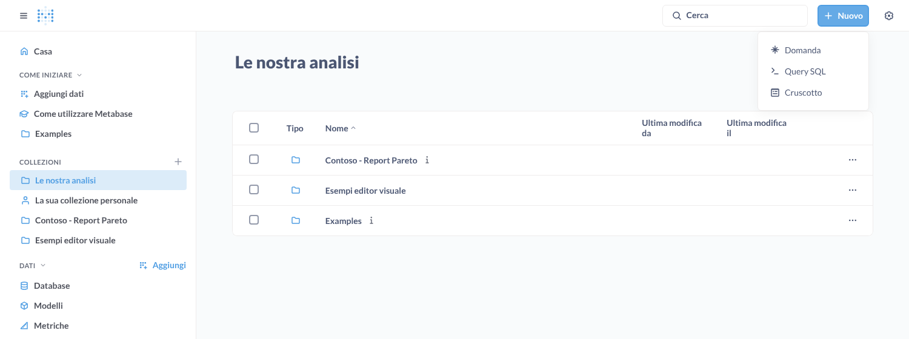
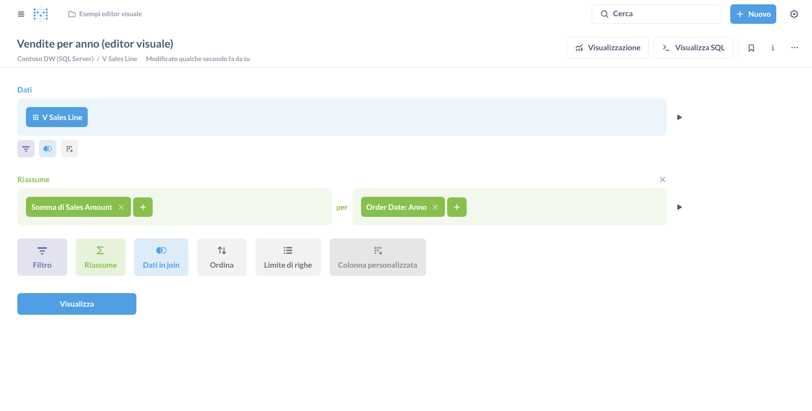
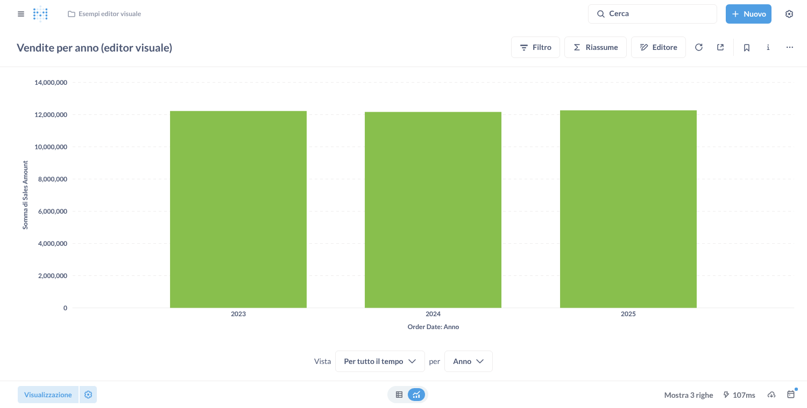

# Guida all'uso di Metabase in locale con SQL Server

Guida pratica per chi impara **da autodidatta** e vuole creare sul proprio PC Windows un piccolo ambiente di reportistica:

- **SQL Server**, come database di appoggio;
- **Metabase Open Source**, per domande, grafici e dashboard;
- **il report Contoso** di questa repository, come esempio funzionante da cui partire.

La parte di installazione (sezioni 2–6) segue **il percorso reale fatto su un PC Windows**, compresi gli errori incontrati e le soluzioni che li hanno risolti. Ogni volta che vedete un riquadro **🧯 Se compare…**, è un problema capitato davvero.

> **Legenda**
> - 🪟 **Provato su Windows**: passaggio eseguito su un PC Windows reale durante la stesura della guida.
> - ✅ **Provato**: verificato in un ambiente di test con la stessa configurazione (Metabase v0.56.6, SQL Server 2022, dati di esempio).
> - **[Non verificato]**: dipende dal vostro PC, dalla versione o da condizioni di licenza; va controllato.
> - **[Inferenza]**: consiglio ragionato, non una regola.

---

## Indice

0. [Il percorso in sintesi (checklist)](#0-il-percorso-in-sintesi-checklist)
1. [Come è fatto l'ambiente](#1-come-è-fatto-lambiente)
2. [Preparare SQL Server](#2-preparare-sql-server)
3. [Installare Docker Desktop (e WSL)](#3-installare-docker-desktop-e-wsl)
4. [Scaricare il progetto e configurarlo](#4-scaricare-il-progetto-e-configurarlo)
5. [Avviare Metabase](#5-avviare-metabase)
6. [Collegare i dati e pubblicare il report](#6-collegare-i-dati-e-pubblicare-il-report)
7. [Usare Metabase: i concetti](#7-usare-metabase-i-concetti)
8. [Esercitazioni passo-passo](#8-esercitazioni-passo-passo)
9. [Gestire l'ambiente nel tempo](#9-gestire-lambiente-nel-tempo)
10. [Risoluzione dei problemi](#10-risoluzione-dei-problemi)
11. [Alternativa senza Docker](#11-alternativa-senza-docker)
12. [Piano di apprendimento](#12-piano-di-apprendimento)
13. [Fonti, rischi e domande aperte](#13-fonti-rischi-e-domande-aperte)

---

## 0. Il percorso in sintesi (checklist)

Spuntate un passo alla volta. Ognuno ha un **controllo** che vi dice se potete andare avanti.

| ✔ | Passo | Controllo: siete pronti per il successivo se… | Sezione |
|---|---|---|---|
| ☐ | SQL Server installato | In `services.msc` c'è **SQL Server (…)** *In esecuzione* | 2.1–2.2 |
| ☐ | Collegamento con SSMS | SSMS si collega a `localhost` | 2.3 |
| ☐ | 4 script eseguiti | In SSMS compare il database **ContosoLab** | 2.4 |
| ☐ | Accesso con password + porta 1433 | SSMS entra con `localhost,1433` e l'utente `metabase_ro` | 2.5–2.7 |
| ☐ | WSL e Docker Desktop | `docker run --rm hello-world` stampa **Hello from Docker!** | 3 |
| ☐ | Progetto scaricato, `.env` creato | Nella cartella c'è il file `.env` | 4 |
| ☐ | Metabase acceso | http://localhost:3000 mostra la pagina di Metabase | 5 |
| ☐ | Report pubblicato | Lo script stampa **Dashboard pronto: http://localhost:3000/dashboard/…** | 6 |

Tempo complessivo [Inferenza]: da 1 a 3 ore la prima volta. La parte più lunga e imprevedibile è WSL/Docker (sezione 3), e dipende molto da come è configurato il PC.

---

## 1. Come è fatto l'ambiente

```
 ┌──────────────────────── IL VOSTRO PC WINDOWS ────────────────────────┐
 │                                                                      │
 │   SQL Server (servizio Windows)          Docker Desktop (su WSL 2)   │
 │   ┌───────────────────────────┐          ┌────────────────────────┐  │
 │   │ Database ContosoLab       │  legge   │ Metabase   :3000       │  │
 │   │  schema contoso           │◄─────────│                        │  │
 │   │  tabelle + vista misure   │  1433    │ appdb (PostgreSQL)     │  │
 │   └───────────────────────────┘          │  memoria di Metabase   │  │
 │          ▲                               └────────────────────────┘  │
 │          │ gestite con SSMS                         ▲                │
 │                                                     │ browser        │
 │                                          http://localhost:3000       │
 └──────────────────────────────────────────────────────────────────────┘
```

| Componente | Che cos'è | Dove vive |
|---|---|---|
| **SQL Server** | Il database con i **vostri dati**: la "cassaforte" | Installato su Windows |
| **SSMS** | Il programma con cui **guardate e gestite** SQL Server. **Non è il database**: è solo la "tastiera" | Installato su Windows |
| **ContosoLab** | Il **contenuto**: tabelle e dati. Non si scarica, lo creano i 4 script | Dentro SQL Server |
| **WSL 2** | Il "Linux dentro Windows" che Docker usa per funzionare | Componente di Windows |
| **Docker Desktop** | Il programma che fa girare Metabase in "scatole" isolate (container) | Installato su Windows |
| **Metabase** | Il programma di **reportistica**: lo usate dal browser | Container Docker |
| **appdb** | Il database dove Metabase salva **domande, dashboard e utenti** (non i vostri dati) | Container Docker |

**Perché così?** [Inferenza]
- SQL Server lo conoscete già e il Contoso originale vive lì.
- Docker evita di installare Java e Metabase a mano: si aggiorna cambiando un numero di versione.
- Tenere le dashboard in un database separato (appdb) rende il backup semplice.

---

## 2. Preparare SQL Server

### 2.1 Avete già il motore SQL Server?

SSMS da solo non basta. Per verificare:

1. Premete **Windows + R**, scrivete `services.msc` e premete **Invio**.
2. Cercate una riga che inizia con **SQL Server (** — per esempio **SQL Server (MSSQLSERVER)** oppure **SQL Server (SQLEXPRESS)**.
3. Se esiste ed è **In esecuzione**, il motore c'è. Il nome tra parentesi è l'**istanza** e vi servirà dopo:

   | Istanza | Come vi collegate in SSMS |
   |---|---|
   | `MSSQLSERVER` (istanza predefinita) | `localhost` |
   | `SQLEXPRESS` o altro nome | `localhost\SQLEXPRESS` |

Se il servizio non c'è, installate SQL Server (passo 2.2).

### 2.2 Installare SQL Server (solo se manca)

1. Andate sulla pagina ufficiale **"SQL Server downloads"** di Microsoft.
2. Scegliete un'edizione gratuita:

   | Edizione | Quando sceglierla |
   |---|---|
   | **Developer** ⭐ | Per imparare e sviluppare: ha tutte le funzioni, ma **non si può usare in produzione** |
   | **Express** | Uso leggero anche in produzione, con limiti di dimensione del database |

3. Avviate il file scaricato e scegliete l'installazione **"Di base"** (Basic). Accettate la licenza e lasciate la cartella proposta.

[Non verificato] Nomi delle edizioni, limiti e condizioni di licenza vanno controllati sul sito Microsoft al momento dell'installazione.

### 2.3 Collegarsi con SSMS 🪟

1. Aprite **SQL Server Management Studio**.
2. Nella finestra **Connetti al server**:
   - **Nome server**: `localhost` (oppure `localhost\SQLEXPRESS`);
   - **Autenticazione**: *Autenticazione di Windows*;
   - spuntate **"Considera attendibile il certificato del server"**.
3. Cliccate **Connetti**.

> 🧯 **Se compare:** *"A connection was successfully established with the server, but then an error occurred during the login process… Catena di certificati emessa da un'Autorità di certificazione non disponibile"*
>
> **Non è un problema di rete.** La prima frase dice proprio che la connessione **è riuscita**. Le versioni recenti di SSMS cifrano la connessione (*Crittografia: Obbligatorio*), e il certificato che SQL Server si crea da solo sul PC non è firmato da un ente riconosciuto.
>
> **Soluzione 🪟:** chiudete il messaggio con OK, spuntate **"Considera attendibile il certificato del server"** e ricliccate **Connetti**.
>
> È lo stesso motivo per cui la configurazione di Metabase usa `trustServerCertificate=true` (sezione 6).

### 2.4 Creare database, dati e utente: i 4 script 🪟

Nella cartella `sqlserver/` di questa repository (vedi sezione 4.1 per scaricarla):

| Script | Cosa fa | Note |
|---|---|---|
| `01_database_e_tabelle.sql` | Crea il database **ContosoLab**, lo schema `contoso` e le 5 tabelle (sales, customer, product, store, date) | Si può rieseguire: ricrea le tabelle **vuote** |
| `02_dati_esempio.sql` | Carica dati **sintetici**: 500 clienti, 60 prodotti, 12 negozi, 30.000 vendite 2023–2025 | Sempre gli stessi numeri a ogni esecuzione |
| `03_vista_misure.sql` | Crea la vista `contoso.v_sales_line` con le misure (vendite, costo, margine) | È il "livello semantico", l'equivalente delle misure DAX |
| `04_utente_metabase.sql` | Crea l'utente **`metabase_ro`**, che **può solo leggere** lo schema `contoso` | Password predefinita: `Cambiami-Metabase-2026!` (pubblica: cambiatela prima di usare dati reali, vedi 9.5) |

Come eseguirli in SSMS:

1. **File → Apri → File…** e scegliete `01_database_e_tabelle.sql`.
2. Premete **F5** (Esegui). In basso, nella scheda *Messaggi*, compare `Database ContosoLab e tabelle creati.`
3. Ripetete per **02**, **03** e **04**, nell'ordine.
4. Nel pannello di sinistra fate clic destro su **Database → Aggiorna**: compare **ContosoLab**.

✅ Provato: al termine lo script 02 mostra `1096 giorni, 500 clienti, 60 prodotti, 12 negozi, 30000 righe_vendita`.

**Verifica finale.** Aprite una **Nuova query** ed eseguite:

```sql
USE ContosoLab;
SELECT SUM(sales_amount) AS vendite, SUM(margin) AS margine
FROM contoso.v_sales_line;
```

✅ Provato: il risultato è circa **36,6 milioni** di vendite e **11,5 milioni** di margine.

> 🧯 **Se avete eseguito lo script 04 senza cambiare la password** 🪟
>
> Non è un problema. Avete due possibilità:
> - **tenere la password predefinita** `Cambiami-Metabase-2026!`: il file `.env.sqlserver.example` contiene già la stessa, quindi combaciano senza toccare niente. Va bene **solo** per una palestra locale con dati di esempio: la password è pubblica su GitHub (vedi 9.5) [Inferenza];
> - **cambiarla**. Attenzione: **rieseguire lo script 04 non la cambia**, perché lo script crea l'utente solo se non esiste ancora. Usate invece, in una Nuova query:
>
>   ```sql
>   ALTER LOGIN metabase_ro WITH PASSWORD = N'LaVostraPassword-2026!';
>   ```
>
>   e scrivete la stessa password nel file `.env`, alla riga `WAREHOUSE_RO_PASSWORD=`.

### 2.5 Attivare l'accesso con utente e password (autenticazione mista)

Metabase entra con **utente e password SQL** (`metabase_ro`), non con l'utente Windows.

1. In SSMS fate **clic destro sulla prima riga** del pannello di sinistra (il nome del server) → **Proprietà**.
2. Nella colonna di sinistra cliccate **Sicurezza**.
3. Selezionate **"Autenticazione di SQL Server e di Windows"** → **OK**.
4. Il riavvio lo facciamo al passo 2.6.

### 2.6 Aprire la porta di rete TCP/IP 1433 🪟

**Perché serve:** SQL Server, appena installato, accetta collegamenti solo dai programmi sullo stesso PC, come SSMS. Metabase gira dentro Docker, che per SQL Server è un "visitatore da fuori": va aperta la porta d'ingresso principale, **TCP/IP** numero **1433**.

**1. Aprite SQL Server Configuration Manager.** Spesso non compare nel menu Start; il modo più sicuro è:

- premete **Windows + R**, scrivete il comando della vostra versione e premete **Invio** (rispondete **Sì** alla richiesta di permesso):

  | Versione SQL Server | Comando |
  |---|---|
  | 2022 | `SQLServerManager16.msc` |
  | 2019 | `SQLServerManager15.msc` |
  | 2017 | `SQLServerManager14.msc` |

**2. Trovate i protocolli.** A sinistra:

```
Gestione configurazione SQL Server
 ├─ Servizi di SQL Server
 ├─ Configurazione di rete SQL Server        ← aprite questa (non quella "32 bit")
 │    └─ Protocolli per MSSQLSERVER          ← cliccate qui (o SQLEXPRESS)
 └─ Configurazione SQL Native Client
```

**3. Accendete TCP/IP.** A destra:

```
 Nome protocollo     Stato
 Memoria condivisa   Abilitato
 Named Pipes         Disabilitato
 TCP/IP              Disabilitato   ← clic destro → Abilita
```

**4. Solo per SQLEXPRESS (o altre istanze con nome):** doppio clic su **TCP/IP** → scheda **Indirizzi IP** → in fondo, sezione **IPAll**:
- **Porte dinamiche TCP**: cancellate il valore e lasciate vuoto;
- **Porta TCP**: `1433`;
- **OK**.

**5. Riavviate SQL Server:** a sinistra **Servizi di SQL Server** → clic destro su **SQL Server (MSSQLSERVER)** → **Riavvia**. Questo riavvio vale anche per il passo 2.5.

### 2.7 Prova finale: entrate come Metabase 🪟

1. In SSMS: **File → Connetti Esplora oggetti…**
2. Compilate:

   | Campo | Valore |
   |---|---|
   | Nome server | `localhost,1433` (con la **virgola**: indica la porta) |
   | Autenticazione | **Autenticazione di SQL Server** |
   | Account di accesso | `metabase_ro` |
   | Password | `Cambiami-Metabase-2026!` (o quella che avete scelto) |
   | Considera attendibile il certificato del server | ✅ spuntato |

3. **Connetti.** Se entrate, SQL Server è pronto per Metabase. ✅

| 🧯 Se compare… | Cosa vuol dire |
|---|---|
| *Accesso non riuscito per l'utente 'metabase_ro'* | Manca il passo 2.5, oppure il riavvio |
| *Impossibile connettersi* / *timeout* | Manca il passo 2.6, oppure il riavvio |
| *Catena di certificati…* | Manca la spunta sul certificato (vedi 2.3) |

### 2.8 Usare i vostri dati invece di quelli di esempio

Avete tre strade, dalla più semplice alla più pulita:

1. **Database Contoso già presente** sul vostro SQL Server: create una vista come `03_vista_misure.sql` che legga dalle vostre tabelle. Poi adattate le query in `report/sql/sqlserver/` ai nomi reali delle colonne.
2. **Dati in Excel o CSV**: in SSMS usate clic destro sul database → **Attività → Importa dati…** (procedura guidata di importazione) e caricateli in una tabella dello schema `contoso`.
3. **Dati da un gestionale**: chiedete all'IT un accesso in sola lettura oppure un'esportazione periodica.

[Inferenza] Tenete separato `ContosoLab` (palestra) da qualunque database aziendale reale.

---

## 3. Installare Docker Desktop (e WSL)

Docker Desktop su Windows ha bisogno di **tre cose**. Su un PC "nuovo" per Docker, spesso nessuna delle tre è pronta: è normale incontrare 2–3 messaggi di errore prima del pallino verde.

| Requisito | Dove si attiva | Messaggio di Docker se manca |
|---|---|---|
| 1. **Virtualizzazione del processore** | BIOS/UEFI del PC | *"No virtualization available"* |
| 2. **Piattaforma macchina virtuale** | Funzione di Windows | *"Virtual Machine Platform not enabled"* |
| 3. **WSL 2** aggiornato | Componente scaricabile | *"WSL not installed"* / *"è necessario aggiornare…"* |

> ⚠️ **Licenza [Non verificato]:** Docker Desktop è gratuito per uso personale, formazione e piccole aziende. Per aziende oltre certe soglie richiede un abbonamento. Su un **PC aziendale** verificate con l'IT; se Docker non è utilizzabile, seguite la [sezione 11](#11-alternativa-senza-docker).

### 3.1 Scaricare e installare Docker Desktop 🪟

1. Scaricate **Docker Desktop for Windows** (versione **AMD64**, quella dei PC Intel/AMD) dal sito ufficiale di Docker.
2. Avviate `Docker Desktop Installer.exe` e lasciate spuntata l'opzione **WSL 2** (*"Use WSL 2 instead of Hyper-V"*).
3. Al termine riavviate il PC.
4. Aprite Docker Desktop, accettate i termini. Il login **non è obbligatorio**: cercate *Skip* / *Continue without signing in*.

### 3.2 🧯 Se compare: *"Virtual Machine Platform not enabled"* / *"No virtualization available"* 🪟

**a) Controllate la virtualizzazione del processore.**

1. Premete **Ctrl + Shift + Esc** (Gestione attività) → **Prestazioni** → **CPU**.
2. In basso a destra cercate **Virtualizzazione**:
   - **Abilitato** → andate al punto b);
   - **Disabilitato** → va attivata nel BIOS/UEFI. Il nome dell'opzione cambia secondo il produttore (spesso *Intel VT-x*, *Intel Virtualization Technology* o *SVM Mode* per AMD) [Non verificato: cercate il manuale del vostro PC]. Su PC aziendali il BIOS può essere protetto: serve l'IT.

**b) Attivate le funzioni di Windows.** Aprite **PowerShell come amministratore** (Start → scrivete *PowerShell* → clic destro → **Esegui come amministratore**) ed eseguite, uno alla volta:

```powershell
Enable-WindowsOptionalFeature -Online -FeatureName VirtualMachinePlatform -All
```

```powershell
Enable-WindowsOptionalFeature -Online -FeatureName Microsoft-Windows-Subsystem-Linux -All
```

Se chiede di riavviare, rispondete **N** e riavviate una volta sola alla fine: **Start → Arresta → Riavvia** (non basta chiudere Docker).

### 3.3 🧯 Se compare: *"WSL not installed"* 🪟

In **PowerShell come amministratore**:

```powershell
wsl --install --no-distribution
```

(`--no-distribution` evita di installare anche Ubuntu, che a Docker non serve.) Poi riavviate il PC.

### 3.4 🧯 Se compare: *"è necessario aggiornare sottosistema Windows per Linux"* e poi *"Tempo esaurito per l'operazione"* 🪟

Succede quando il download automatico di WSL (dal Microsoft Store) è lento o bloccato dalla rete. Due soluzioni, nell'ordine:

**Soluzione 1 — scaricare dal web invece che dallo Store:**

```powershell
wsl --update --web-download
```

**Soluzione 2 — installazione manuale (quella usata nel percorso reale) 🪟:**

1. Aprite **https://github.com/microsoft/WSL/releases**.
2. Nella versione più recente (etichetta **Latest**), sezione **Assets**, scaricate il file **`wsl.X.Y.Z.0.x64.msi`** (circa 350 MB).

   | File negli Assets | Serve? |
   |---|---|
   | **wsl.…x64.msi** | ✅ Sì: PC Intel/AMD |
   | wsl.…arm64.msi | Solo PC con processore ARM |
   | …msixbundle, …nupkg, Source code | ❌ No |

3. Doppio clic sul file → Avanti → Installa → Fine.
4. Riavviate il PC.

### 3.5 Verifica finale di Docker 🪟

Dopo il riavvio, in PowerShell (anche normale):

```powershell
wsl --version
```

Deve comparire un elenco con **Versione WSL: …**. Poi aprite **Docker Desktop**, aspettate il pallino verde **Engine running** in basso a sinistra e provate:

```powershell
docker run --rm hello-world
```

Se tra le righe compare **Hello from Docker!**, Docker è pronto. ✅

---

## 4. Scaricare il progetto e configurarlo

### 4.1 Scaricare la repository 🪟

- **Senza Git**: su GitHub aprite la repository → pulsante verde **Code → Download ZIP** → estraete il file.

  > 🧯 **Cartella doppia** 🪟: estraendo lo ZIP con Windows si ottiene spesso `reporting-metabase-main\reporting-metabase-main\`. La cartella giusta è **quella interna**, cioè quella che contiene direttamente `docker-compose.sqlserver.yml`, `scripts`, `sqlserver`…

- **Con Git** (consigliato per aggiornarla nel tempo):

  ```powershell
  cd C:\Progetti
  git clone https://github.com/FrankLucs84/reporting-metabase.git
  ```

### 4.2 Aprire PowerShell nella cartella giusta (trucco) 🪟

1. Aprite la cartella del progetto con Esplora file.
2. Cliccate sulla **barra dell'indirizzo** in alto, scrivete `powershell` e premete **Invio**.

Si apre PowerShell **già posizionato nella cartella**. La riga di comando termina con il nome della cartella, per esempio `...\reporting-metabase-main\reporting-metabase-main>`.

> 💡 Se all'inizio della riga vedete **`(base)`**, sul PC c'è **Anaconda**: Python è già installato e vi servirà nella sezione 6.

### 4.3 Creare il file di configurazione `.env` 🪟

```powershell
Copy-Item .env.sqlserver.example .env
```

Se non compare nessun messaggio, ha funzionato. Il file `.env` contiene già valori pronti per l'uso locale:

| Riga | Valore predefinito | Quando cambiarla |
|---|---|---|
| `WAREHOUSE_RO_PASSWORD` | `Cambiami-Metabase-2026!` | Solo se avete cambiato la password di `metabase_ro` (2.4) |
| `MB_ADMIN_EMAIL` / `MB_ADMIN_PASSWORD` | `admin@example.com` / `Cambiami-Admin-2026!` | Se volete credenziali vostre per entrare in Metabase |
| `MB_APPDB_PASSWORD` | `cambiami-appdb` | Facoltativo, per l'uso locale |
| `MB_WAREHOUSE_HOST` | `host.docker.internal` | **Non va cambiato**: è il nome con cui Docker raggiunge il vostro PC |
| `MB_WAREHOUSE_PORT` | `1433` | Solo se avete scelto un'altra porta in 2.6 |

Per modificarlo: `notepad .env`.

> Il file `.env` contiene password: **non va mai caricato su GitHub**. È già escluso tramite `.gitignore`.

---

## 5. Avviare Metabase 🪟

**Docker Desktop deve essere aperto, con il pallino verde.** Poi, nella stessa PowerShell:

```powershell
docker compose -f docker-compose.sqlserver.yml --env-file .env up -d
```

- La **prima volta** Docker scarica due immagini: `postgres:16-alpine` (circa 115 MB) e `metabase/metabase:v0.56.6`, la più grande. Vedrete righe con **Pulling** e delle barre di avanzamento.
- 🪟 Nel percorso reale il download è stato **lento** (pochi MB al minuto): può servire anche più di **10–20 minuti**. Non chiudete la finestra.
- Alla fine compaiono righe come `✔ Container metabase-locale-metabase-1 Started` e torna il cursore.

Metabase impiega poi circa **1–2 minuti** ad accendersi. Per controllare:

```powershell
docker compose -f docker-compose.sqlserver.yml ps
```

Quando la riga di **metabase** dice **(healthy)**, aprite il browser su **http://localhost:3000**.

⚠️ **Se usate la strada A della sezione 6, non compilate la pagina di benvenuto**: lo script la configura da solo.

Per spegnere tutto (i dati restano salvati):

```powershell
docker compose -f docker-compose.sqlserver.yml --env-file .env down
```

✅ Provato: con questo file Metabase si avvia e raggiunge SQL Server tramite `host.docker.internal:1433`.

---

## 6. Collegare i dati e pubblicare il report

Ci sono due strade. **Scegliete la A per avere subito il report Contoso**; la B serve per imparare il collegamento a mano.

### Strada A — Automatica con lo script (consigliata per iniziare)

1. **Python**:
   - se in PowerShell vedete **`(base)`**, avete già Anaconda: usate i comandi con **`python`** qui sotto;
   - altrimenti installate **Python 3.10 o successivo** da python.org, spuntando **"Add python.exe to PATH"**, e usate i comandi con **`py`**.

2. Nella cartella del progetto, uno alla volta:

   | Con Anaconda `(base)` | Con Python da python.org |
   |---|---|
   | `pip install -r scripts\requirements.txt` | `py -m pip install -r scripts\requirements.txt` |
   | `python scripts\deploy.py apply` | `py scripts\deploy.py apply` |

3. Lo script:
   - crea l'amministratore di Metabase con le credenziali del `.env`;
   - collega il database **Contoso DW (SQL Server)** con l'utente `metabase_ro`;
   - crea la collezione **Contoso - Report Pareto** con 9 domande;
   - crea il dashboard **Contoso - Vendite e Pareto clienti**.
4. Alla fine stampa l'indirizzo del dashboard, di solito http://localhost:3000/dashboard/2. Entrate con `MB_ADMIN_EMAIL` e `MB_ADMIN_PASSWORD` del `.env`.

✅ Provato su SQL Server 2022: il dashboard funziona con tutti i filtri.



> Lo script è **ripetibile**: se cambiate una query in `report/sql/sqlserver/` e lo rilanciate, le domande vengono aggiornate senza creare doppioni.

### Strada B — A mano dall'interfaccia

1. Al primo accesso su http://localhost:3000 Metabase propone una **configurazione guidata**: lingua, nome, email e password dell'amministratore.

   > Se poi volete usare anche la strada A, usate **le stesse credenziali** scritte nel `.env`.

2. Al passo **"Aggiungi i tuoi dati"** (oppure dopo, da ⚙️ → **Impostazioni amministratore → Database → Aggiungi database**) compilate:

   | Campo (come appare nell'interfaccia) | Valore |
   |---|---|
   | Tipo database | **SQL Server** |
   | Nome da visualizzare | `Contoso DW (SQL Server)` |
   | Ospite *(è l'host: traduzione letterale)* | `host.docker.internal` |
   | Porta | `1433` |
   | Nome del database | `ContosoLab` |
   | Database instance name | vuoto, se avete fissato la porta 1433 in 2.6 |
   | Nome utente | `metabase_ro` |
   | Password | quella dello script 04 |
   | Usa una connessione sicura (SSL) | attivo |
   | **Mostra opzioni avanzate** → Opzioni stringhe di connessione JDBC aggiuntive | `trustServerCertificate=true` |

   

   `trustServerCertificate=true` è l'equivalente della spunta **"Considera attendibile il certificato del server"** di SSMS (vedi 2.3): accetta il certificato "fatto in casa" di un SQL Server locale. Su un server aziendale con un certificato valido non serve.

3. Salvate. Metabase **sincronizza** il database: legge l'elenco di tabelle e colonne, senza copiare i dati.



> **Come legge i dati Metabase?** Ogni volta che aprite un grafico, Metabase manda una query a SQL Server e mostra il risultato. I dati non vengono copiati: se aggiornate una tabella in SSMS, il grafico mostra subito il dato nuovo. La "sincronizzazione" aggiorna solo l'elenco di tabelle e colonne. Di default Metabase fa una sincronizzazione leggera ogni ora e una scansione dei valori una volta al giorno (✅ indicato nelle opzioni avanzate del modulo). Potete forzarla con **"Sincronizza lo schema del database"**.

---

## 7. Usare Metabase: i concetti

### 7.1 Dizionario minimo (con l'equivalente Power BI)

| Metabase (interfaccia italiana) | Cos'è | Equivalente Power BI |
|---|---|---|
| **Domanda** | Una singola interrogazione con il suo grafico o tabella | Un visual |
| **Query SQL** | Una domanda scritta in SQL invece che con l'editor visuale | Visual su una query nativa / DAX avanzato |
| **Cruscotto** (dashboard) | Una pagina con più domande e filtri comuni | Una pagina di report |
| **Collezione** | Una cartella che raccoglie domande e cruscotti, con i suoi permessi | Workspace / cartella |
| **Modello** | Una tabella "pulita" e documentata, costruita da una domanda, da riusare come base | Tabella del modello semantico |
| **Metrica** | Una misura salvata con un nome (es. "Margine") e riusabile in altre domande | Misura DAX |
| **Filtro del cruscotto** | Un selettore collegato a una o più domande | Slicer |
| **Metadati della tabella** | Descrizioni, tipi di colonna, colonne nascoste | Proprietà delle colonne nel modello |

### 7.2 Dove si trovano le cose

- **+ Nuovo** (in alto a destra) → **Domanda**, **Query SQL**, **Cruscotto**.
- Barra laterale → sezione **Dati** → **Database**, **Modelli**, **Metriche**.
- ⚙️ (in alto a destra) → **Impostazioni amministratore**: database, persone, permessi.



### 7.3 I tre modi per creare una misura

| Livello | Dove | Esempio | Quando usarlo |
|---|---|---|---|
| **1. Nel database** (SQL) | Vista in SQL Server, come `contoso.v_sales_line` | `quantity * net_price AS sales_amount` | Misure base usate ovunque: una sola definizione, un solo posto |
| **2. In Metabase, senza codice** | Editor visuale → **Riassume**, oppure espressione personalizzata, oppure **Metrica** salvata | `Sum([Margin]) / Sum([Sales Amount])` | Misure di analisi, create anche da chi non scrive SQL |
| **3. In una Query SQL** | Domanda SQL | Pareto con funzioni finestra (`SUM() OVER`) | Logiche complesse, come i cumulati o la classificazione ABC |

[Inferenza] Regola pratica: **misure base nel database, misure di analisi in Metabase, logiche complesse in SQL**. È la scelta fatta nel report di esempio.

---

## 8. Esercitazioni passo-passo

Le esercitazioni usano il database di esempio. Salvate le vostre prove in **La sua collezione personale**, così non toccate la collezione del report gestita dallo script.

### Esercizio 1 — Prima domanda con l'editor visuale (senza codice)

**Obiettivo:** vendite totali per anno.

1. **+ Nuovo → Domanda**.
2. **Dati**: scegliete il database `Contoso DW (SQL Server)` e poi la tabella **V Sales Line**.
3. **Riassume**: scegliete **Somma di… → Sales Amount**.
4. **per**: scegliete **Order Date → Anno**.
5. Premete **Visualizza**: compare un grafico a barre con 3 anni.
6. **Salva**, con un nome chiaro, per esempio "Vendite per anno".





✅ Provato: con i dati di esempio ogni anno vale circa 12 milioni.

> 💡 Il pulsante **Visualizza SQL** mostra la query SQL che Metabase ha generato: ottimo per imparare l'SQL guardando.

### Esercizio 2 — Collegare le tabelle (join) e filtrare

**Obiettivo:** vendite per categoria di prodotto, solo in Italia.

1. Nuova domanda su **V Sales Line**.
2. **Dati in join** → tabella **Product**, collegando `Product Key` = `Product Key`.
3. Di nuovo **Dati in join** → tabella **Store**, su `Store Key`.
4. **Filtro** → **Store → Country** è **Italia**.
5. **Riassume**: Somma di Sales Amount **per** Product → Category.
6. **Visualizzazione** → **Barre**.

È esattamente quello che in Power BI fanno le relazioni del modello. [Inferenza] Per non rifare ogni volta i join, dichiarate le chiavi esterne in **Impostazioni amministratore → Metadati della tabella**, oppure create un Modello (esercizio 4).

### Esercizio 3 — Una misura con espressione personalizzata (come DAX `DIVIDE`)

**Obiettivo:** il margine % per categoria.

1. Partite dall'esercizio 2, senza filtro.
2. In **Riassume** fate clic su **+** → **Espressione personalizzata**.
3. Scrivete:

   ```
   Sum([Margin]) / Sum([Sales Amount])
   ```

4. Nome: `Margine %`. In **Visualizzazione → impostazioni della colonna** scegliete lo stile **Percentuale**.

Equivalenza DAX: `DIVIDE([Margin], [Sales Amount])`.

Altre espressioni utili [Non verificato: elenco completo nella documentazione "Custom expressions"]:

| Espressione | Cosa fa |
|---|---|
| `[Quantity] * [Net Price]` | Colonna calcolata riga per riga (in **Colonna personalizzata**) |
| `case([Margin] < 0, "Perdita", "Utile")` | Classificazione, come `IF` / `SWITCH` |
| `SumIf([Sales Amount], [Category] = "Audio")` | Somma condizionata, come `CALCULATE` con un filtro |
| `CountIf([Quantity] > 3)` | Conteggio condizionato |
| `Distinct([Customer Key])` | Conteggio distinto, come `DISTINCTCOUNT` |

### Esercizio 4 — Un Modello: la "tabella pulita" da riusare

**Obiettivo:** una tabella vendite già unita a prodotto e negozio, con nomi di colonna chiari.

1. Ricreate la domanda dell'esercizio 2, senza filtri né riassunto: solo i join.
2. Salvatela, poi dal menu **…** scegliete **Trasforma in modello** [Non verificato: la voce può cambiare nome tra versioni].
3. Nel modello rinominate le colonne in italiano e aggiungete una descrizione.
4. Da qui in poi create le domande partendo da **Modelli → il vostro modello**: niente più join.

### Esercizio 5 — Una Metrica: la misura con un nome

**Obiettivo:** definire "Margine" una sola volta e riusarlo.

1. Barra laterale → sezione **Dati** → **Metriche** → pulsante per creare una nuova metrica [Non verificato: etichetta esatta del pulsante; in questa versione il menu **+ Nuovo** non ha la voce Metrica].
2. Fonte: **V Sales Line**, oppure il modello dell'esercizio 4.
3. Misura: **Somma di Margin**. Nome: `Margine`. Salvate.
4. In una nuova domanda, in **Riassume**, la trovate tra le **metriche** e potete usarla per qualunque raggruppamento.

✅ Provato via API su questa versione: una metrica "Somma di Margin" restituisce 11.506.738,94, lo stesso valore della vista SQL.

### Esercizio 6 — Query SQL con variabili (filtri nel codice)

**Obiettivo:** capire come funzionano le query del report.

1. **+ Nuovo → Query SQL** → database `Contoso DW (SQL Server)`.
2. Incollate:

   ```sql
   SELECT product.category,
          SUM(v_sales_line.sales_amount) AS vendite
   FROM contoso.v_sales_line
   JOIN contoso.product ON product.product_key = v_sales_line.product_key
   WHERE {{periodo}}
   GROUP BY product.category
   ORDER BY vendite DESC
   ```

3. A destra compare il pannello della variabile `periodo`:
   - **Tipo di variabile**: **Filtro di campo**;
   - **Campo**: `V Sales Line → Order Date`;
   - **Tipo di widget**: data.
4. Eseguite: in alto compare un selettore di date funzionante.

Due regole importanti, usate in tutto il report:

- Con i **filtri di campo** le tabelle **non vanno rinominate con alias** (scrivete `contoso.product`, non `contoso.product p`). Metabase genera il filtro usando il nome completo della tabella.
- Una variabile di **testo**, per esempio `{{metric}}` nel Pareto, viene sostituita con un valore tra apici (`'Margin'`). Così una sola query può calcolare misure diverse, come la tabella disconnessa `Metric` di Power BI.

### Esercizio 7 — Un cruscotto con filtri

1. **+ Nuovo → Cruscotto** → nome "Il mio primo cruscotto".
2. Aggiungete le domande degli esercizi 1, 3 e 6 (icona **+**), poi trascinate e ridimensionate i riquadri.
3. Aggiungete un **filtro**: icona del filtro → **Data** → **Tutte le opzioni**.
4. **Collegate** il filtro a ogni riquadro, scegliendo la colonna data (o la variabile `periodo` per la domanda SQL).
5. **Salva**. Ora un solo selettore filtra tutto il cruscotto, come uno slicer.

---

## 9. Gestire l'ambiente nel tempo

### 9.1 Comandi di uso quotidiano (PowerShell, nella cartella del progetto)

| Azione | Comando |
|---|---|
| Avviare | `docker compose -f docker-compose.sqlserver.yml --env-file .env up -d` |
| Spegnere | `docker compose -f docker-compose.sqlserver.yml --env-file .env down` |
| Stato | `docker compose -f docker-compose.sqlserver.yml ps` |
| Leggere i log di Metabase | `docker compose -f docker-compose.sqlserver.yml logs --tail 100 metabase` |
| Ripubblicare il report | `python scripts\deploy.py apply` (oppure `py …`, vedi 6.A) |
| Controllare il report senza pubblicarlo | `python scripts\deploy.py validate` |

> Con `restart: unless-stopped` i container ripartono da soli quando Docker Desktop si avvia. Se volete che Metabase parta all'accensione del PC, attivate in Docker Desktop **Settings → General → Start Docker Desktop when you sign in** [Non verificato: il nome dell'opzione può cambiare].

### 9.2 Backup

| Cosa | Perché | Come |
|---|---|---|
| **Dashboard, domande e utenti di Metabase** | Sono nel database appdb, non nei file | Vedi i comandi qui sotto |
| **Dati di SQL Server** | Sono i vostri dati | In SSMS: clic destro su `ContosoLab` → **Attività → Backup…** |
| **Report gestito da codice** | È già salvato in Git | `git commit` e `git push` |

Backup del database interno di Metabase:

```powershell
docker compose -f docker-compose.sqlserver.yml exec appdb pg_dump -U metabase -f /tmp/backup.sql metabase
docker compose -f docker-compose.sqlserver.yml cp appdb:/tmp/backup.sql .\backup_metabase.sql
```

> Questi due comandi evitano il simbolo `>` di PowerShell, che può salvare il file con una codifica sbagliata.

### 9.3 Aggiornare Metabase

1. Fate il **backup** (9.2).
2. In `.env` cambiate `METABASE_VERSION` con la nuova versione (per esempio `v0.57.x`) [Non verificato: scegliete una versione stabile dalle release ufficiali].
3. Rilanciate il comando di avvio: Docker scarica la nuova versione e Metabase aggiorna da solo il suo database.
4. Rilanciate `python scripts\deploy.py apply` e controllate il dashboard.

[Inferenza] Aggiornate una versione alla volta e non subito il giorno dell'uscita.

### 9.4 Ricominciare da zero

```powershell
docker compose -f docker-compose.sqlserver.yml --env-file .env down -v
```

L'opzione `-v` **cancella** domande e dashboard di Metabase; i dati di SQL Server restano. Per azzerare anche quelli, rieseguite gli script 01 e 02.

### 9.5 Sicurezza: cambiare le password di esempio

Le password nei file `.env.*.example` e nello script `04_utente_metabase.sql` sono **pubblicate su GitHub**, quindi vanno considerate **note a chiunque**.

**Quanto è rischioso tenerle?** Dipende da chi può raggiungere il PC [Inferenza]:

| Situazione | Rischio | Perché |
|---|---|---|
| PC a casa, dati di esempio, Metabase limitato al PC | **Basso** | Metabase risponde solo su `127.0.0.1` (✅ provato); `metabase_ro` può solo **leggere** dati sintetici |
| PC in una rete condivisa (ufficio, Wi-Fi pubblico) | **Medio** | SQL Server ascolta sulla porta 1433: se il firewall di Windows la lascia passare, qualcuno della stessa rete può provare le password note |
| Dati reali o aziendali nel database | **Alto** | Chi conosce la password può leggere tutto lo schema `contoso` |

**Cosa è già protetto per costruzione:**
- Metabase è pubblicato solo su `127.0.0.1:3000`: dagli altri dispositivi della rete non si raggiunge (✅ provato).
- Il database interno di Metabase (`appdb`) non è esposto fuori da Docker.
- `metabase_ro` ha solo il permesso di **lettura** sullo schema `contoso`: non può modificare né cancellare dati (✅ provato: un `DELETE` viene rifiutato).

**Cambiare le password (10 minuti) — da fare prima di usare dati reali:**

1. **Utente del database `metabase_ro`.** In SSMS, Nuova query:
   ```sql
   ALTER LOGIN metabase_ro WITH PASSWORD = N'UnaPasswordSoloVostra-2026!';
   ```
   Poi nel `.env` (`notepad .env`) aggiornate `WAREHOUSE_RO_PASSWORD=` con la stessa password.
2. **Amministratore di Metabase.** In Metabase: icona in alto a destra → **Impostazioni account** → **Password** [Non verificato: etichette esatte dei menu]. Poi aggiornate `MB_ADMIN_PASSWORD=` nel `.env` (e, se volete, `MB_ADMIN_EMAIL=` con la vostra email).
3. **Rilanciate lo script**, che aggiorna la password del database salvata in Metabase:
   ```powershell
   python scripts\deploy.py apply
   ```
4. **Controllate l'utente `sa`.** In SSMS → **Sicurezza → Account di accesso → sa** → clic destro **Proprietà → Stato**: se non lo usate, lasciatelo **Disabilitato**; se è abilitato, dategli una password robusta.

**Regole d'oro:**
- il file `.env` resta solo sul vostro PC: è escluso da Git e **non va mai caricato su GitHub** né inviato via email;
- non aprite la porta 1433 nel firewall verso la rete se non serve: Metabase in Docker la raggiunge dall'interno del PC;
- password diverse per ogni utente, e diverse da quelle che usate altrove.

---

## 10. Risoluzione dei problemi

Prima di tutto rileggete i riquadri **🧯 Se compare…** delle sezioni 2–5: raccolgono gli errori incontrati davvero durante l'installazione su Windows.

### 10.1 SQL Server e SSMS

| Sintomo | Causa probabile | Soluzione |
|---|---|---|
| In SSMS: *"A connection was successfully established… Catena di certificati emessa da un'Autorità di certificazione non disponibile"* 🪟 | Connessione cifrata con certificato non firmato da un ente riconosciuto | Spuntate **"Considera attendibile il certificato del server"** (2.3) |
| Il comando `SQLServerManager16.msc` non viene trovato | Versione di SQL Server diversa dalla 2022 | Provate `SQLServerManager15.msc` (2019) o `SQLServerManager14.msc` (2017) (2.6) |
| Rieseguire lo script 04 non cambia la password 🪟 | Lo script crea l'utente solo se non esiste | `ALTER LOGIN metabase_ro WITH PASSWORD = N'…';` (2.4) |
| *Accesso non riuscito per l'utente 'metabase_ro'* | Autenticazione mista disattivata, servizio non riavviato o password diversa dal `.env` | Passi 2.5 e 2.6 (riavvio), poi allineate `WAREHOUSE_RO_PASSWORD` |
| *Impossibile connettersi* / *timeout* su `localhost,1433` | TCP/IP disattivato, porta diversa o servizio fermo | Passo 2.6 e riavvio del servizio |

### 10.2 WSL e Docker

| Sintomo | Causa probabile | Soluzione |
|---|---|---|
| Docker: *"Virtual Machine Platform not enabled"* 🪟 | Funzione di Windows spenta | Comandi `Enable-WindowsOptionalFeature` come amministratore, poi riavvio (3.2) |
| Docker: *"No virtualization available"* | Virtualizzazione spenta nel BIOS, oppure funzione Windows spenta | Controllo in Gestione attività → CPU (3.2) |
| Docker: *"WSL not installed"* 🪟 | WSL assente | `wsl --install --no-distribution`, poi riavvio (3.3) |
| `wsl --version` chiede di aggiornare e poi dice *"Tempo esaurito per l'operazione"* 🪟 | Download dallo Store lento o bloccato | `wsl --update --web-download`, oppure il file `.x64.msi` da GitHub (3.4) |
| `docker` non è riconosciuto, oppure *"docker daemon is not running"* | Docker Desktop chiuso o non ancora pronto | Aprite Docker Desktop e attendete *Engine running* |
| Il download delle immagini è lentissimo 🪟 | Connessione lenta o rete aziendale | Attendete senza chiudere; in alternativa provate un'altra rete |

### 10.3 Metabase e script

| Sintomo | Causa probabile | Soluzione |
|---|---|---|
| *"no configuration file provided"* / file non trovato | PowerShell non è nella cartella giusta (attenzione alla cartella doppia dello ZIP) | Ripetete 4.1 e 4.2 |
| http://localhost:3000 non risponde | Metabase ancora in avvio | Attendete 1–2 minuti e controllate con `ps` (9.1) |
| Collegando il database: *Connection refused* / *timeout* | TCP/IP disattivato, porta diversa da 1433 o servizio SQL Server fermo | Passo 2.6 e verifica 2.7 |
| Errore di certificato / *SSL* / *PKIX* / *encrypt* | Il certificato del SQL Server locale non è riconosciuto | `trustServerCertificate=true` nelle opzioni JDBC (6.B); lo script lo fa da solo |
| Le tabelle non compaiono in Metabase | Sincronizzazione non ancora fatta, oppure mancano i permessi | ⚙️ → Database → **Sincronizza lo schema**; verificate lo script 04 |
| `python` / `py` non è riconosciuto | Python non installato o non nel PATH | Vedi 6.A: Anaconda (`python`) oppure python.org (`py`) |
| Lo script dice *Metabase non risponde* | Metabase spento o su una porta diversa | Controllate `MB_URL` nel `.env` e che Metabase sia avviato |
| Lo script si ferma con *401* o *password* | Credenziali admin diverse da quelle usate nella configurazione guidata | Allineate `MB_ADMIN_EMAIL` e `MB_ADMIN_PASSWORD` nel `.env` |
| Funziona in SSMS ma non da Metabase | Il firewall di Windows blocca la porta 1433 dal "lato Docker" [Non verificato] | Regola in ingresso per la porta TCP 1433 (Windows Defender Firewall → Impostazioni avanzate) |

---

## 11. Alternativa senza Docker

Se Docker Desktop non si può usare (per esempio per la licenza su un PC aziendale), Metabase gira anche come **singolo file JAR**:

1. Installate **Java** nella versione richiesta dalla release di Metabase [Non verificato: per le versioni recenti è Java 21; controllate le note di rilascio].
2. Scaricate `metabase.jar` dalla pagina ufficiale (versione Open Source) in una cartella, per esempio `C:\Metabase`.
3. Avviatelo:

   ```powershell
   cd C:\Metabase
   java -jar metabase.jar
   ```

4. Aprite http://localhost:3000. Nel collegamento al database usate **Host `localhost`** invece di `host.docker.internal`.
5. Per lo script di deploy, nel `.env` impostate `MB_WAREHOUSE_HOST=localhost`.

Differenze rispetto a Docker:

| Aspetto | JAR | Docker (questa repository) |
|---|---|---|
| Installazione | Serve Java | Serve Docker Desktop |
| Memoria di Metabase | File locale H2 (`metabase.db.mv.db`) nella cartella | Database PostgreSQL dedicato (appdb) |
| Adatto a | Imparare, prove personali | Uso più stabile e duraturo |
| Avvio automatico | Da configurare a mano (es. Utilità di pianificazione) | Automatico con Docker Desktop |

[Inferenza] Metabase stesso sconsiglia il database H2 per l'uso in produzione. Per imparare va benissimo, ma fate copie del file `.mv.db` a Metabase spento.

---

## 12. Piano di apprendimento

| Settimana | Obiettivo | Attività | Risultato verificabile |
|---|---|---|---|
| 1 | Ambiente funzionante | Sezioni 2–6 | Dashboard Contoso visibile su localhost:3000 |
| 2 | Domande senza codice | Esercizi 1–3 | 3 domande salvate nella collezione personale |
| 3 | Riuso | Esercizi 4–5, metadati delle tabelle | 1 modello e 2 metriche usati in nuove domande |
| 4 | SQL e filtri | Esercizi 6–7 | Un cruscotto con almeno un filtro collegato a tutte le domande |
| 5 | Dati vostri | Sezione 2.6 con un vostro file Excel o CSV | Un cruscotto con dati reali, non di esempio |
| 6 | Manutenzione "as code" | Aggiungere una card al `report.yml` e pubblicarla con lo script | Modifica salvata in Git e visibile nel dashboard |

**Come fare la settimana 6** (aggiungere una domanda al report gestito da codice):

1. Create `report/sql/sqlserver/vendite_per_brand.sql` (e la versione PostgreSQL in `report/sql/postgres/`, se usate anche quella).
2. Aggiungete la voce in `cards:` e la posizione in `dashboard.layout`, nel file `report/report.yml`.
3. `python scripts\deploy.py validate`, poi `python scripts\deploy.py apply` (oppure con `py`, vedi 6.A).
4. `git add`, `git commit`, `git push`: la CI su GitHub ricontrolla tutto.

---

## 13. Fonti, rischi e domande aperte

### Fonti ufficiali

| Fonte | Indirizzo |
|---|---|
| Documentazione Metabase | https://www.metabase.com/docs/latest/ |
| Tutorial Metabase (Learn) | https://www.metabase.com/learn/ |
| Codice sorgente Metabase | https://github.com/metabase/metabase |
| Download SQL Server (Microsoft) | pagina "SQL Server downloads" sul sito Microsoft |
| Docker Desktop | https://docs.docker.com/desktop/ |

### Rischi e vincoli

| ID | Rischio / vincolo | Impatto | Mitigazione | Stato |
|---|---|---|---|---|
| R1 | Licenza Docker Desktop su PC aziendale | Uso non conforme | Verifica con l'IT, oppure alternativa JAR (sezione 11) | [Non verificato] |
| R2 | Configurazione di Windows diversa da PC a PC (BIOS, WSL, rete aziendale, versione di SSMS) | Blocchi all'avvio | Riquadri 🧯 delle sezioni 2–5 e tabella della sezione 10, basati sul percorso reale | Parzialmente verificato 🪟: SSMS, script, TCP/IP, WSL e Docker provati su un PC Windows; lo script di deploy su Windows [Non verificato] |
| R3 | Dati di esempio scambiati per dati reali | Decisioni errate | Il nome `ContosoLab` e i commenti negli script segnalano dati sintetici | Certo |
| R4 | Perdita di dashboard create a mano | Lavoro perso | Backup di appdb (9.2); il report gestito da codice è in Git | Certo |
| R5 | Le modifiche a mano nella collezione "Contoso - Report Pareto" vengono sovrascritte dallo script | Lavoro perso | Lavorare nella collezione personale o in un'altra collezione | Certo |
| R7 | Password di esempio pubblicate su GitHub usate con dati reali o in rete condivisa | Accesso non autorizzato ai dati | Cambio password (9.5); Metabase limitato a `127.0.0.1`; utente in sola lettura | Mitigato in parte per costruzione; cambio password a carico dell'utente |
| R6 | Le edizioni gratuite (SQL Server Express, Metabase OSS) hanno funzioni limitate (dimensione DB, RLS, SSO) | Limiti in crescita | Rivalutare le edizioni quando l'ambiente passa da "palestra" a "servizio" | [Non verificato: limiti attuali] |

### Domande aperte

1. Che istanza SQL Server avete: predefinita (`MSSQLSERVER`) o con nome (`SQLEXPRESS`)? Cambia il passo 2.6.
2. Docker Desktop è consentito sul vostro PC? Altrimenti seguite la sezione 11.
3. Quali dati reali volete analizzare per primi (file Excel, Contoso, gestionale)? Determina il passo 2.8.
